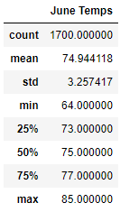
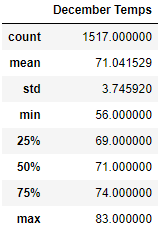
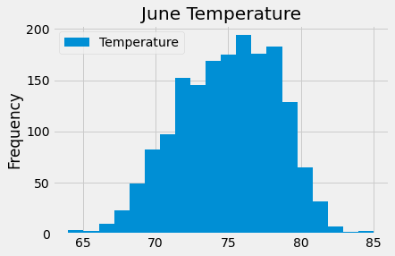
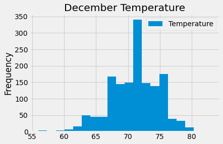
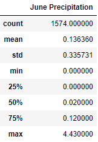
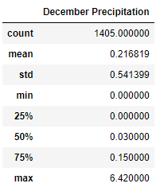
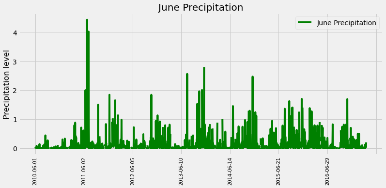
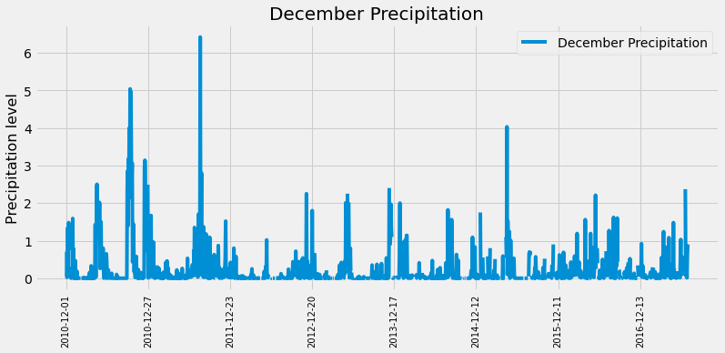

# Surfs Up

## Overview of the analysis

Aloha Oahu!

This analysis determines the summary statistics for June and December temperatures in Hawaii, Oahu for several years. Final results will help investors to make a decision if an idea to open a Surf'n'Shake shop, serving surfboards and ice cream, is worth their money.

## Results

Original data was provided in SQLite database format. Using SQLAlchemy we were able to connect to provided database, filter data as needed, convert it to a DataFrame and provide summary statistics.

Original database contains information for a period from 2010 till 2017. Since we need only data for June and December months from all years `extract()` function was used.

For example, to get temperature for June below code was used. Here, Measurement.tobs stands for temperature observations and `extract('month', Measurement.date)==6` means that we are extracting only data for June (6th month) from all database: 

```
results_june = session.query(Measurement.tobs).\
    filter(extract('month', Measurement.date)==6).all()
```

To get summary statistics results `describe()` function was used.

|                                                   |                                                 |
| ------------------------------------------------- | ------------------------------------------------|
|  |  |

As from above results we can see that:
- Average temperatures are different on only 4 degrees and remain on the 71°F level;
- Standard deviation for December is higher than for June, which means that temperature data is more spread out for December, and more clustered around the mean for June;
- Minimum temperature for December is lower than for June on 8 degrees (56 and 64 degrees respectively). But maximum temperatures are very close for both months and the difference is only 2 degrees.

## Summary

Final results for both months show us that although minimum temperature for December is lower and standard deviation is higher than for June, there is no huge difference between summer and winter periods on Oahu, which makes this place a paradise on Earth to spend vacation at any time of the year.

Summary statistics gives us a lot of information, but sometimes it is more comfortable to see graphical details. As from below we can see that June temperatures indeed more clustered but on the other hand, minimum temperature for December is not going lower than 56 degrees:

|                                                     |                                                   |
| --------------------------------------------------- | --------------------------------------------------|
|  |  |

It is great to know information about the temperature but what if it is hot and rainy? Knowing details of precipitation level is also very important to make a final decision on investing for a future shop.

Using refactoring of the code we can get summary statistics for precipitation for both months. 

Here we can see that there is not much difference of average levels of precipitation between two months. Also 75% of data is on a very low level for both months:

|                                                  |                                               |
| ------------------------------------------------ | ----------------------------------------------|
|  |  |

Maximum precipitation for June was 4.43 and for December 6.42 but from below tables we can see that it was only rainy 2011 year:




As an additional data it would be great to make a deep analysis using information from special surf reports, such as wave height, wind direction, swell direction and the tide.

As a summary of already provided information, we can see that Oahu is a perfect place for Surf'n'Shake shop with a great temperature during both summer and winter months and a low level of precipitation.
Oh, and there is Dole Plantation on Oahu! Dole Whip, wait for us!